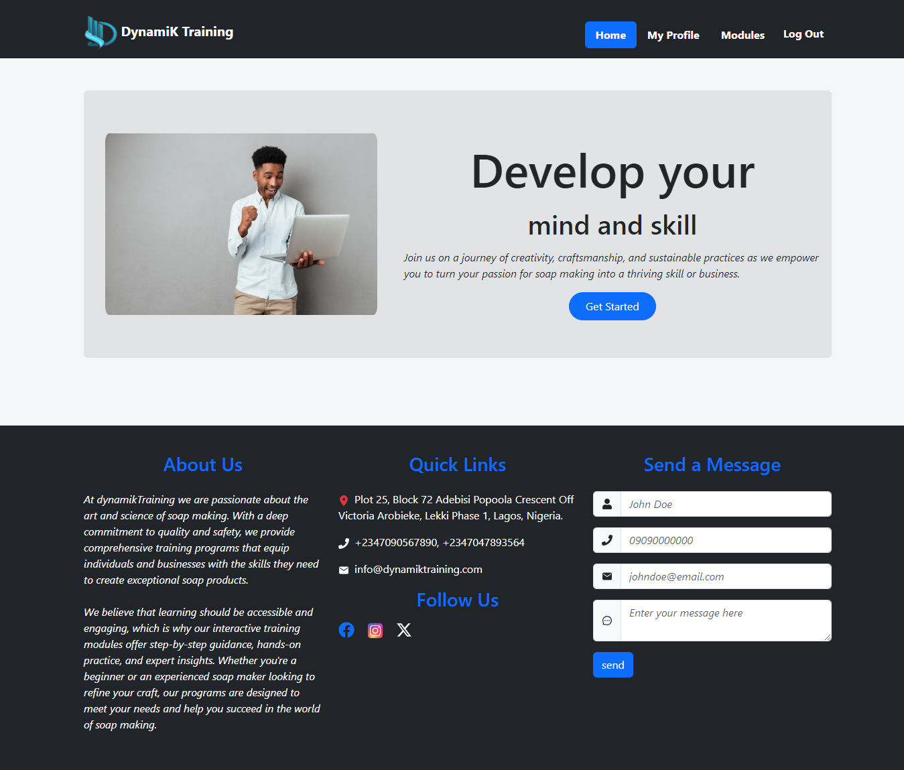

# dynamikTraining



## Project Overview

DynamikTraining application is an innovative platform designed to
provide comprehensive training modules for employees, focusing on
sequential video content delivery, interactive learning, and progress
tracking.

### Built With

- [vite](https://vitejs.dev/guide/)
- Rest Api
- HTML5
- CSS
- Bootstrap css

## Getting Started

To get started with this project, follow the steps below:

### Installation

1. Clone the repository.

   ```sh
   git clone https://github.com/ChinenyeNmoh/dynamikTraining
   ```

2. Install the required packages.
   ```sh
   npm install package.json
   ```
3. Configure your .env file with your email and password credentials for sending mails and also the following fields

   ```sh
   PORT=YOUR_PORT
   MONGO_URI=YOUR_MONGO_URI
   BASE_URL =BASE_URL
   HOST=EMAIL_HOST
   SERVICE=EMAIL_SERVICE
   PASS=GOOGLE_APP_PASSWORD
   USER=MAIL_USERNAME
   CLIENT_CAPTCHA=GOOGLE_RECAPTCHA_CLIENT
   SERVER_CAPTCHA=GOOGLE_RECAPTCHA_SECRET

   ```

### Start the application for development.

```sh
npm run dev
```

### preparing for deployment.

```sh
npm run build
```

### live website

(https://dynamiktraining.onrender.com/)

To learn more about deployment, [see this](https://vitejs.dev/guide/static-deploy.html)

## Author

- Chinenye Nmoh [Github](https://github.com/ChinenyeNmoh/) / [Linkedin](https://www.linkedin.com/in/chinenye-nmoh-88479699/) / [Email](chinenyeumeaku@gmail.com)
